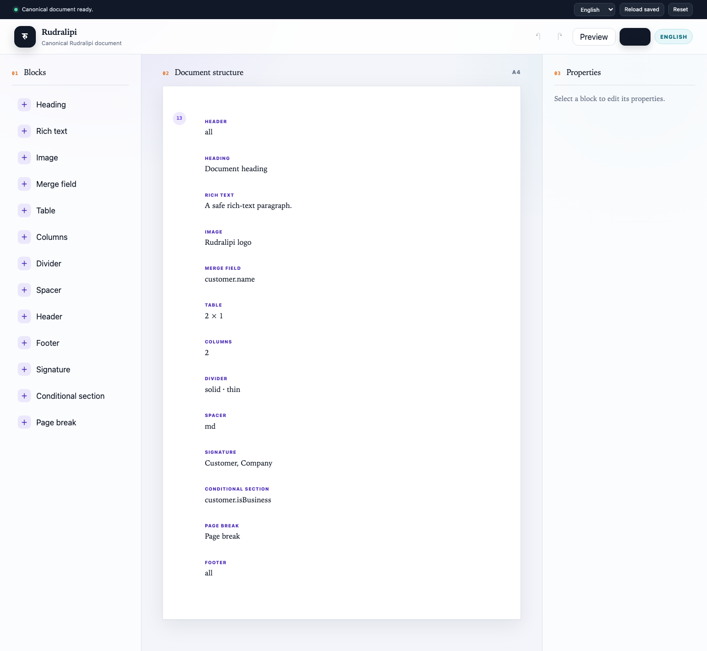

# Rudralipi

Rudralipi (रुद्रलिपि, “Rudra’s script/writing”) is an open-source document
composition and visual editing engine. It turns controlled, versioned document
JSON into deterministic semantic HTML and print CSS, with an optional PDF
transport. It is standalone, product-independent, self-hostable, and has no
commercial editor or cloud requirement.

> **Pre-alpha:** schema and extension contracts may change before `1.0.0`.
> Persisted format changes require explicit migrations and release notes.



## Why Rudralipi

- The source of truth is portable validated JSON, never stored arbitrary HTML,
  executable templates, Tailwind class strings, or scripts.
- Browser editing and backend rendering share the same schema, compiler, and
  diagnostics.
- Merge fields, conditions, assets, fonts, pagination, headers, footers, long
  tables, and page breaks are controlled contracts.
- English, German, Italian, and Turkish are complete built-in editor locales.
- Persistence, authorization, tenancy, business data, assets, and PDF services
  remain behind host-owned adapters.
- Headless backends import no React, DOM, Tiptap, Zustand, or editor code.

## Architecture

```text
React editor -> versioned Rudralipi JSON -> validation/compiler
             -> deterministic renderer IR -> HTML + print CSS
             -> browser preview or optional Gotenberg adapter
```

| Package                        | Responsibility                                        |
| ------------------------------ | ----------------------------------------------------- |
| `@rudralipi/core`              | Schema, migrations, commands, history, registries     |
| `@rudralipi/compiler`          | Merge/condition evaluation, assets, fonts, policy, IR |
| `@rudralipi/renderer-html`     | Semantic HTML, CSP, preview and print CSS             |
| `@rudralipi/localization`      | Framework-neutral locale contracts and catalogs       |
| `@rudralipi/editor-react`      | Controlled accessible React editor                    |
| `@rudralipi/rich-text-tiptap`  | Replaceable adapter for the owned rich-text AST       |
| `@rudralipi/adapter-gotenberg` | Optional defensive PDF transport                      |
| `@rudralipi/testing`           | Canonical and paged-document fixtures                 |

Read the maintained [architecture](docs/architecture/design.md), [integration
guide](docs/guides/integration.md), [document model](docs/guides/document-model.md),
and [PDF guide](docs/guides/pdf-and-print.md).

## Run the playground

Requirements are Node.js 22.12 or newer, Corepack, and Yarn 4.7.0.

```sh
corepack enable
yarn install --immutable
yarn workspace @rudralipi/playground dev
```

The playground persists only to browser storage and proves validation on
reload. Its preview is compiled and rendered from the current document rather
than copied from the editor DOM.

## Verify

```sh
yarn verify:release
```

This runs formatting, lint, package-boundary checks, strict type checking,
tests, production builds, public headless-import checks, locale completeness,
and Playwright browser/visual contracts.

See [CONTRIBUTING.md](CONTRIBUTING.md) for development rules,
[SECURITY.md](SECURITY.md) for private vulnerability reporting, and the
[alpha roadmap](docs/roadmap/alpha.md) for contract-stability milestones.

## License

Apache License 2.0. It permits commercial reuse and modification while adding
an explicit patent grant and notice obligations. See [LICENSE](LICENSE) and
[NOTICE](NOTICE).
